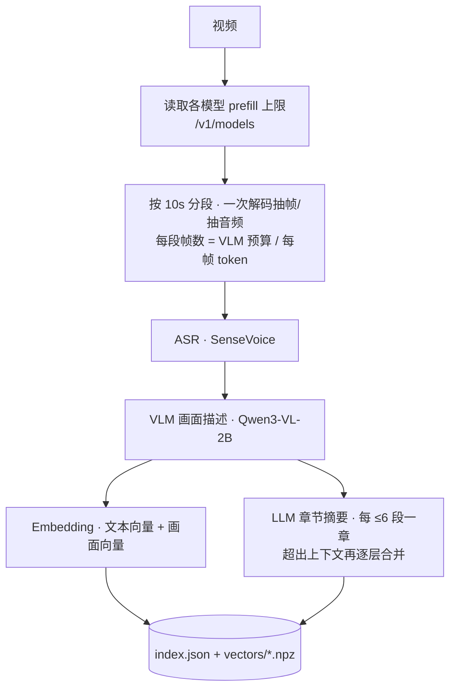
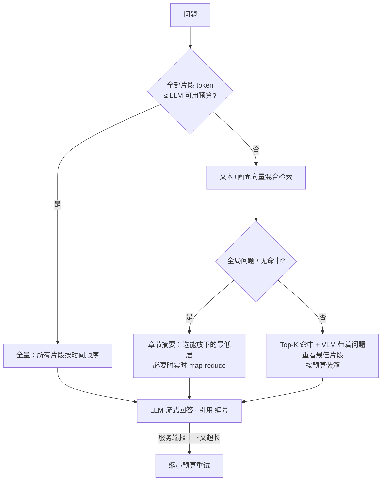

# VideoAgent — 视频理解与智能问答（基于 AX650N）

**长视频智能理解** | **多模态检索增强生成（RAG）** | **AX650N 边缘 AI 部署**

<p align="center">
  
  
  
</p>

---

基于 AX650N 芯片平台构建的多模态 VideoAgent，融合 **ASR 语音识别 + VLM 视觉描述 + 多模态向量检索 + LLM 问答**，面向长视频的智能索引、跨模态检索与自然语言问答。专为 **AX650N 边缘 AI 芯片**优化，可在边缘设备上实现完整的视频理解与智能问答。


[观看演示视频](https://github.com/user-attachments/assets/41ab57cb-63b8-4692-ae52-4f51f84f0145)

---

## 目录

- [项目背景](#项目背景)
- [核心特性](#核心特性)
- [系统架构](#系统架构)
- [快速开始](#快速开始)
- [使用方式](#使用方式)
- [案例演示](#案例演示)
- [硬件资源使用](#硬件资源使用)
- [常见问题](#常见问题)
- [参考项目](#参考项目)

---

## 项目背景

### 为什么需要视频智能问答？

视频是信息密度最高的媒介之一，但也最难被检索利用。一段长视频里同时承载着**画面内容、语音信息、时间脉络**，传统方式难以精准定位其中的关键片段。

现实痛点：

- **信息埋没** — 长视频、会议录像、监控录像时长动辄数小时，人工翻看效率极低，关键信息难以快速定位。
- **模态割裂** — 画面里"看到什么"与语音里"说了什么"被分开处理，无法统一理解与检索。
- **语义鸿沟** — 关键词匹配无法理解"有人摔倒"与画面中跌倒动作之间的语义关联，跨模态检索难以实现。
- **隐私与延迟** — 云端多模态服务需上传视频，存在隐私泄露风险与网络延迟，不适合敏感场景。

### 本项目的解决思路

本项目将视频切分为片段，对每个片段同时提取**语音文字（ASR）**与**视觉描述（VLM）**，融合后编码进统一的多模态向量空间，实现真正的跨模态语义检索；再由大语言模型（LLM）基于检索到的多模态上下文生成回答。全部模型运行在 AX650N 边缘芯片上，整条 RAG 管线本地执行：

- 🔒 **数据不出设备** — 解析、向量化、推理全部本地完成，杜绝隐私泄露风险。
- 💰 **零调用成本** — 一次硬件投入，无限次使用，适合长视频批量处理。
- 🧠 **语义级理解** — 向量检索理解语义，从画面与语音中召回相关片段，而非简单关键词匹配。

### 技术路线选型

| 环节 | 选型 | 考量 |
|------|------|------|
| 语音识别（ASR） | SenseVoiceSmall | 多语言语音理解，提取视频语音转文字 |
| 视觉描述（VLM） | Qwen3-VL-2B-Instruct | 为视频片段生成画面描述，补齐视觉语义 |
| 多模态嵌入 | Qwen3-VL-Embedding-2B | 视觉+文本统一嵌入空间，2048 维，支持片段特征检索 |
| 大语言模型（LLM） | Qwen3-1.7B | 小参数量、推理扎实，负责关键词抽取与答案生成 |
| 向量数据库 | NanoVectorDB | 轻量持久化存储，文本与视频片段特征分库管理 |
| 推理框架 | axllm（Embedding / VLM / LLM） | OpenAI 兼容 API，统一调用接口 |
| 硬件平台 | AX650N NPU | 高能效 NPU 端侧运行全部模型 |

### 应用场景

| 领域 | 典型场景 | 核心价值 |
|------|---------|---------|
| 🏢 **会议与办公** | 会议录像检索、培训视频问答 | 快速定位"谁在何时说了什么"，无需逐段回看 |
| 🎬 **媒体与影视** | 素材资产管理、镜头检索 | 用自然语言描述快速定位所需片段 |
| 🛡️ **安防与监控** | 监控录像事件定位 | 文字描述快速召回异常事件发生的时间段 |
| 🎓 **教育与科研** | 教学视频问答、课程资源检索 | 按知识点跨视频检索，辅助学习与整理 |
| 📱 **内容与直播** | 短视频/直播内容分析 | 理解视频内容，支持内容审核与二次创作 |

---

## 核心特性

### 🚀 功能特性

- **视频智能索引**：自动分段、语音识别、画面描述、多模态向量化；边描述边生成**章节摘要**，一键完成长视频入库。
- **上下文自适应**：自动读取各模型服务的 **prefill 上限**，据此决定每段抽几帧、一次能放多少资料、何时分段整合，不会再因为 prompt 超长而"没反应"。
- **三种回答策略**：内容放得下就全量通读；具体问题走多模态检索 + VLM 带着问题重新观察；「描述/概括这段视频」这类全局问题使用分层章节摘要（map-reduce）。
- **全过程可视化**：索引时像"跟着 AI 一起看视频"，播放窗口轮播正在分析的帧，时间轴逐段点亮；提问时逐步展示 token 预算、策略、检索命中、章节整合与最终上下文。
- **带时间定位的回答**：回答用 [编号] 引用资料，自动导出对应视频片段播放。
- **增量入库**：按文件指纹去重，已索引视频自动跳过。

### 🔧 技术特性

- **端侧全栈部署**：ASR / VLM / LLM / Embedding 全部跑在 AX650N（板端或 AXCL 加速卡）。
- **轻依赖**：客户端只需 `requests / numpy / Pillow / gradio`，不再需要 torch、transformers、Tokenizer 服务和向量数据库。
- **单卡优先**：默认只需 VLM + ASR（≈2.4 GB CMM），Embedding / 独立 LLM 可选；多卡部署时各阶段自动流水线并行。
- **健壮性**：服务忙（429）自动排队重试；上下文溢出自动缩减重试；小模型偶发空回答自动换 prompt 重试；错误直接显示在界面上。

---

## 系统架构

### 视频索引流程



### 查询流程



预算的计算方式：`可用预算 = min(prefill 上限, 上下文长度 − 回答预留) × 安全系数 − 系统提示 − 问题`。
没有 `tokenizer.json` 时用估算 + 服务端返回的 `usage.prompt_tokens` 自动校准。

### 项目目录

```
VideoAgent-AX650N/
├── VideoAgent/
│   ├── agent.py        # VideoAgent 门面：index() / ask() / query() / status()
│   ├── config.py       # 所有配置（读取 .env）
│   ├── clients.py      # axllm LLM/VLM/Embedding 客户端 + 上限探测、ASR 客户端
│   ├── tokens.py       # token 计数（精确或估算+自动校准）
│   ├── media.py        # ffmpeg：探测、一次解码抽帧/抽音频、导出片段
│   ├── indexer.py      # 索引流水线 + 章节摘要
│   ├── query.py        # 自适应问答（全量 / 检索 / 章节整合）
│   ├── store.py        # 索引存储（JSON + npz）
│   ├── prompts.py      # 提示词
│   └── __main__.py     # 命令行
├── servers/
│   ├── sensevoice_asr_server.py  # SenseVoice（pyaxengine，板端/AXCL 通用）
│   └── sherpa_asr_server.py      # SenseVoice（sherpa-onnx，板端 aarch64）
├── webui.py            # Gradio 界面（过程可视化）
└── .env.example
```

---

## 快速开始

### 1. 模型

| 模型类型 | 模型 | 说明 |
|---------|------|------|
| **ASR** | [SenseVoice](https://huggingface.co/AXERA-TECH/SenseVoice) | 多语言语音识别 |
| **VLM** | [Qwen3-VL-2B-Instruct-GPTQ-Int4](https://huggingface.co/AXERA-TECH/Qwen3-VL-2B-Instruct-GPTQ-Int4) | 片段画面描述 |
| **LLM**（可选） | [Qwen3-1.7B](https://huggingface.co/AXERA-TECH/Qwen3-1.7B) | 不配置时由 VLM 兼任 |
| **Embedding**（可选） | [Qwen3-VL-Embedding-2B-AX650](https://huggingface.co/AXERA-TECH/Qwen3-VL-Embedding-2B-AX650-C128_P1280_CTX1407) | 文本/画面统一向量，2048 维 |

### 2. 启动模型服务

需要较新的 [axllm](https://github.com/AXERA-TECH/ax-llm)（`/v1/models` 会返回 `prefill_max_token_num` / `max_token_len`；旧版本也能用，首次启动时会自动测一次上限并缓存）。

**单卡（默认，一颗 AX650 / 一张 AXCL 卡）**：只需要 VLM + ASR，VLM 同时承担 LLM 的工作。

| 组合 | CMM | 说明 |
|------|-----|------|
| VLM + ASR（默认） | ≈ 2.4 GB | 具体问题由模型读章节摘要定位片段 |
| + Embedding | ≈ 5.1 GB | 增加文本/画面向量检索（画面向量能找到描述里漏掉的视觉细节） |
| + 独立 LLM（Qwen3-1.7B） | +2.2 GB | 回答窗口更大（prefill 2176 vs 1280）；四个模型合计 7.3 GB，单卡放不下 |

```bash
# 板端 AX650；AXCL 加速卡用 AXLLM_DEVICES=<卡号> 指定卡
axllm serve /path/to/Qwen3-VL-2B-Instruct-GPTQ-Int4 --port 8011
# 可选
# axllm serve /path/to/Qwen3-VL-Embedding-2B-AX650-C128_P1280_CTX1407 --port 8010
# axllm serve /path/to/Qwen3-1.7B --port 8012

# ASR（pyaxengine，板端和 AXCL 通用；AXCL 用 AXCL_DEVICE_ID 选卡）
pip install -r servers/requirements-asr.txt
SENSEVOICE_DIR=/path/to/SenseVoice python servers/sensevoice_asr_server.py --port 8013
```

单卡实测（AXCL，3 分钟视频，VLM + Embedding + ASR 同卡）：索引 7 分 42 秒；「描述这段画面」约 10 秒，具体问题约 10 秒（无 Embedding）/ 25～30 秒（有 Embedding，含 VLM 重看最佳片段）。

### 3. 安装与配置

```bash
sudo apt install ffmpeg
pip install -r requirements.txt
cp .env.example .env      # 按需修改服务地址
python -m VideoAgent status   # 检查各服务与自动读取到的上下文上限
```

### 4. 启动

```bash
python webui.py           # http://localhost:7869
```

---

## 使用方式

### Web UI

- **视频索引**：上传视频后可以实时看到 AI 正在观看的片段、逐段生成的描述和转写、时间轴与章节摘要。
- **智能问答**：右侧「推理过程」面板展示上下文预算条、所选策略、检索命中（带相似度）、VLM 重看结果、章节整合和最终进入上下文的片段；回答下方是引用片段的视频。
- **已索引视频**：查看每个视频的时间轴、章节摘要和全部片段，可删除索引。
- **系统状态**：各服务地址、自动读取到的 prefill / 上下文上限、每帧图像 token 数。

### 命令行

```bash
python -m VideoAgent index assets/sanguo.mp4
python -m VideoAgent ask "用简体中文描述这段画面"
python -m VideoAgent ask "有人在宣读告示吗？在什么时候？" --video sanguo
```

### Python SDK

```python
from VideoAgent import VideoAgent

agent = VideoAgent("./working_dir")
agent.index(["video1.mp4", "video2.mp4"])            # 已索引的自动跳过

res = agent.query("视频中什么时候出现张飞？")          # {"answer", "refs", "mode"}
print(res["answer"])

for ev in agent.ask("用简体中文描述这段画面"):        # 流式：status / plan / hits / condensed / context / delta / done
    if ev["type"] == "delta":
        print(ev["text"], end="", flush=True)
```

---

## 案例演示

检索《三国演义》视频片段中的特定内容：

<video controls src="assets/sanguo.mp4" title="三国演义示例视频"></video>

### 使用步骤

**1. 在 AX650N 芯片上启动相关服务**

Embedding 服务

VLM 服务

LLM 服务

ASR 服务

运行启动服务


**2. 上传原始视频构建索引：**

上传需要进行索引的视频文件，支持播放正在进行索引的视频，查看已完成索引的视频列表。


**3. 完成索引后进行内容检索：**

输入内容进行检索，根据输入内容和相关文本/视频片段生成最终回答，支持播放检索到的视频片段。

例如输入「磨盘」，检索到包含「磨盘」的视频片段：


可按需设置检索的视频/文本片段数目、阈值等参数：


---

## 硬件资源使用

基于 AX650N 平台运行本项目时，内存（CMM）、Flash 占用情况如下：


---

## 常见问题

### Q: 提问后「没反应」？

旧版本的两个原因：① 回答前要做关键词抽取 + 两次 VLM 重新描述，界面在 1～3 分钟内只显示"正在检索"；② 拼好的 prompt 很容易超过 Qwen3-1.7B 的 prefill 上限（2176 token），axllm 直接返回错误。
现在的版本会自动读取上限并按预算组织上下文，超长时自动缩减重试，每一步进度都显示在「推理过程」面板里；概括类问题直接使用索引时生成的章节摘要。

### Q: 索引很慢，如何加速？

耗时主要在 VLM 画面描述（每段一次，单卡约 14 秒）。可以增大 `VIDEOAGENT_SEGMENT_SECONDS`、减小 `VIDEOAGENT_MAX_FRAMES_PER_SEGMENT` 或 `VIDEOAGENT_CAPTION_MAX_TOKENS`；不配 Embedding 也能省掉每段的向量编码。

### Q: 回答慢？

具体问题会让 VLM 带着问题重新观察最佳片段（约 20～30 秒），`VIDEOAGENT_REFINE_TOP_N=0` 可关闭。

### Q: 检索不到相关片段？

全局问题或没有命中时会自动改用章节摘要回答；也可调低 `VIDEOAGENT_SCORE_THRESHOLD` 或增大 `VIDEOAGENT_TOP_K`。

### Q: 如何确认各模型服务已就绪？

`python -m VideoAgent status`，或 Web UI 的「系统状态」页。

### Q: 重复索引同一视频会怎样？

按文件内容指纹去重，已索引的直接跳过；在「已索引视频」页删除后可重新索引。

---
